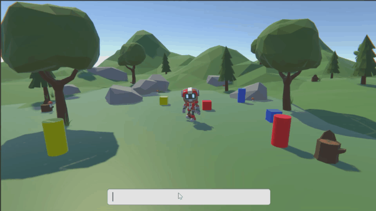

# Jammo The Robot

Jammo The Robot is a project made with Unity and Hugging Face 🤗 where you’ll learn to make this smart robot 🤖.
The robot acts based on player input using a deep language model to understand any text input and find the closest action of its list.

                                                          
The Tutorial: 👉 https://thomassimonini.medium.com/building-a-smart-robot-ai-using-hugging-face-and-unity-a78724810545
                                                          
                                                          
The Project Files: 👉 https://bit.ly/3CcL1sU

## I just want to try directly the Robot
In this case:
- Follow Step 1 of the Tutorial
- Open FinalScene in `Scenes/FinalScene/`
- Follow Step 2 paragraph Fill the inspector
- Click on the play button in the editor. And you can prompt some orders and see the results.
